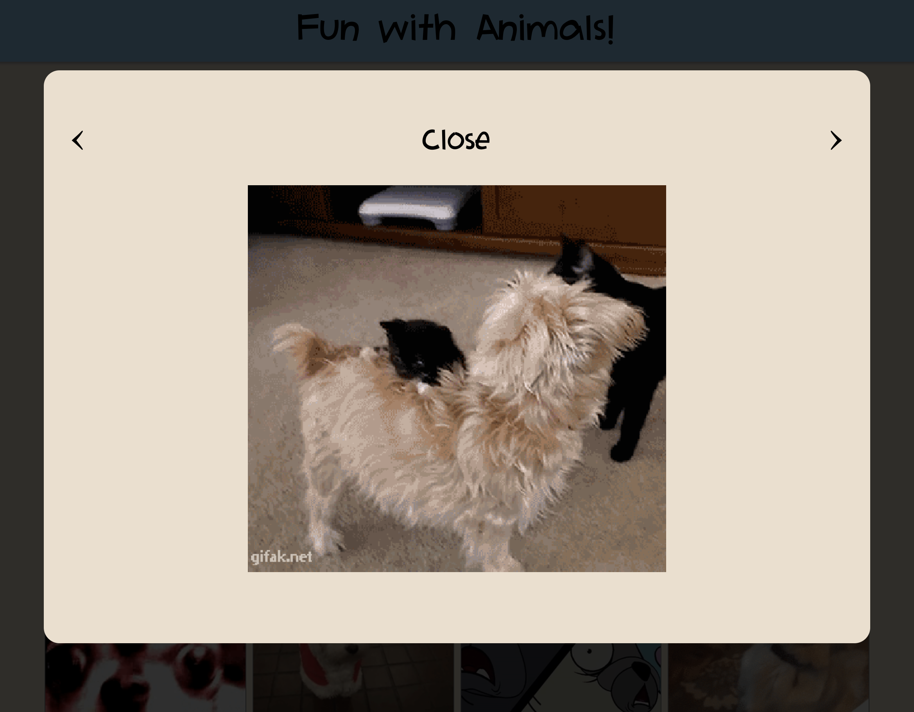

# GIPHY APP - Fun with Animals
React App for Fetching Random Giphies from the Giphy API based on a list of Animals.

### WIREFRAME:

[View](./Wireframe.pdf)

### DEPLOYED
[View](https://giphies.netlify.com)

### RUNNING LOCALLY

**Prerequisite:** install NVM if not already installed [Click Here](https://github.com/creationix/nvm)

Node version is **lts/carbon**

```nvm use && npm install && npm start```

Client will run on localhost:3000

### TESTING
```nvm use && npm install && npm run test``` or ```nvm use && npm install && npm run test:watch```

### ADDITIONAL IMPROVEMENTS THAT CAN BE IMPLEMENTED
1. Use onload prop of image to wait for all Giphies to load and then start showing them (for slow connections)
2. Add tests for GiphyModal component
3. Add sounds when animal is selected
4. More UI Design

### SCREENSHOTS

##### MOBILE
   

##### DESKTOP
   
